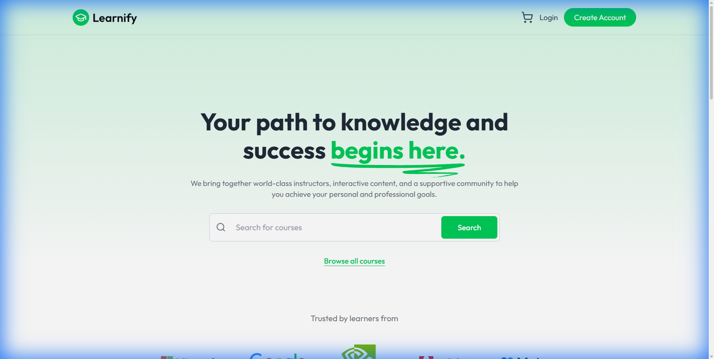
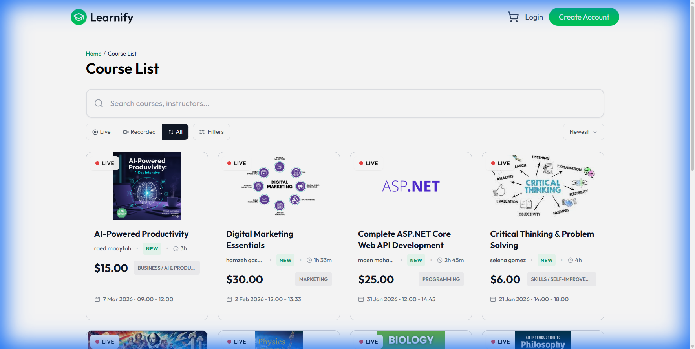
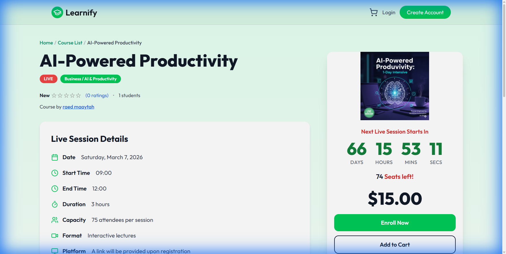

<div align="center">

  

  <br />
  <br />

  ### The Modern Learning Management System

  [](https://learnifyplatform.online)
  [](https://dotnet.microsoft.com/)
  [](https://reactjs.org/)
  [](https://www.microsoft.com/sql-server)
  [](https://tailwindcss.com/)

  <p align="center">
    <strong>A production-ready, full-stack e-learning platform connecting educators with students worldwide.</strong>
  </p>

  <p align="center">
    <a href="https://learnifyplatform.online"> Live Demo</a> •
    <a href="#features">Features</a> •
    <a href="#architecture">Architecture</a> •
    <a href="#screenshots">Screenshots</a> •
    <a href="#tech-stack">Tech Stack</a>
  </p>

</div>

---

## 📖 Overview

**Learnify** is a comprehensive Learning Management System (LMS) designed to bridge the gap between educators and students. Built with modern technologies and production-ready architecture, it provides:

-  **Live & Recorded Courses** — Support for scheduled live sessions and on-demand video content
-  **Secure Payments** — Individual and group enrollment with discount options
-  **Analytics Dashboards** — For both educators and administrators
-  **Automated Communications** — Template-based email notifications for all platform events
-  **Enterprise Security** — JWT authentication, role-based access, and OTP verification

---

##  Features

<table>
<tr>
<td width="50%" valign="top">

###  Student Experience
- **Course Discovery** — Advanced search with category, price, and rating filters
- **Interactive Learning** — Video player with chapter navigation and progress tracking
- **Group Enrollments** — Invite friends for discounted group pricing
- **Reviews & Ratings** — Community feedback system
- **Personal Dashboard** — Track enrolled courses and resume learning

</td>
<td width="50%" valign="top">

###  Educator Experience
- **Course Builder** — Rich content creation with chapters and video lectures
- **Live Sessions** — Schedule and manage real-time classes
- **Analytics** — Track enrollments, revenue, and student engagement
- **Income Management** — Request payout statements
- **Public Profile** — Showcase courses and build teaching brand

</td>
</tr>
<tr>
<td colspan="2">

###  Admin Capabilities
- **User Management** — Complete oversight of all accounts with ban/delete controls
- **Content Moderation** — Review and approve courses before publishing
- **Enrollment Control** — Manage, cancel, or refund student enrollments
- **Platform Analytics** — High-level insights into platform health

</td>
</tr>
</table>

---

##  Architecture

Learnify follows a **clean client-server architecture** enabling independent scaling and development.

```
┌─────────────────────────────────────────────────────────────────────────────┐
│                              CLIENT LAYER                                   │
│  ┌───────────────────────────────────────────────────────────────────────┐  │
│  │                    React 18 SPA (Vite + Tailwind)                     │  │
│  │       • Component-based UI        • Context State Management          │  │
│  │       • Axios HTTP Client         • React Router Navigation           │  │
│  └───────────────────────────────────────────────────────────────────────┘  │
└─────────────────────────────────────┬───────────────────────────────────────┘
                                      │ HTTPS / REST API
┌─────────────────────────────────────▼───────────────────────────────────────┐
│                              SERVER LAYER                                   │
│  ┌───────────────────────────────────────────────────────────────────────┐  │
│  │                    ASP.NET Core 9 Web API                             │  │
│  │       • RESTful Controllers       • JWT Authentication                │  │
│  │       • Service Layer             • Entity Framework Core             │  │
│  │       • Email Templates           • File Upload Handling              │  │
│  └───────────────────────────────────────────────────────────────────────┘  │
└─────────────────────────────────────┬───────────────────────────────────────┘
                                      │ EF Core ORM
┌─────────────────────────────────────▼───────────────────────────────────────┐
│                               DATA LAYER                                    │
│  ┌───────────────────────────────────────────────────────────────────────┐  │
│  │                      Microsoft SQL Server                             │  │
│  │       • Users & Authentication    • Courses & Content                 │  │
│  │       • Enrollments & Progress    • Payments & Reviews                │  │
│  └───────────────────────────────────────────────────────────────────────┘  │
└─────────────────────────────────────────────────────────────────────────────┘
```

### Deployment Architecture

```
                    ┌──────────────────┐
                    │   Azure Cloud    │
                    └────────┬─────────┘
                             │
          ┌──────────────────┼──────────────────┐
          │                  │                  │
          ▼                  ▼                  ▼
   ┌─────────────┐    ┌─────────────┐    ┌─────────────┐
   │  Frontend   │    │   Backend   │    │  Database   │
   │   (Static)  │    │  (App Svc)  │    │ (SQL Server)│
   └─────────────┘    └─────────────┘    └─────────────┘
```

---

##  Screenshots

<div align="center">

###  Homepage
*Modern hero section with course search and discovery*

<!-- TODO: Add homepage screenshot -->
<!--  -->

<br />

###  Course Catalog
*Browse and filter through available courses with advanced search capabilities*

<!-- TODO: Add course list screenshot -->
<!--  -->

<br />

###  Course Details
*Detailed course information with live session countdown and enrollment options*

<!-- TODO: Add course detail screenshot -->
<!--  -->

<br />

###  Educator Dashboard
*Analytics overview with enrollments, earnings, and course management*

<!-- TODO: Add educator dashboard screenshot -->
<!--  -->

<br />

###  Course Management
*Create and manage courses with chapters and video lectures*

<!-- TODO: Add educator courses screenshot -->
<!--  -->

<br />

###  Student Enrollments
*Track enrolled courses and learning progress*

<!-- TODO: Add student enrollments screenshot -->
<!--  -->

<br />

###  Video Player
*Interactive learning interface with chapter navigation and progress tracking*

<!-- TODO: Add video player screenshot -->
<!--  -->

<br />

###  Admin Panel
*User management and platform oversight*

<!-- TODO: Add admin dashboard screenshot -->
<!--  -->

</div>

---

##  Tech Stack

| Layer | Technologies |
|-------|-------------|
| **Frontend** | React 18, Vite, Tailwind CSS, Axios, React Router, Framer Motion |
| **Backend** | .NET 9, ASP.NET Core Web API, Entity Framework Core, MailKit |
| **Database** | Microsoft SQL Server |
| **Authentication** | JWT (JSON Web Tokens), OTP Email Verification |
| **UI Components** | PrimeReact, Lucide Icons, React Toastify, Recharts |
| **Video** | React YouTube Player, Custom Progress Tracking |
| **Rich Text** | Quill Editor |
| **CI/CD** | GitHub Actions, Azure App Service |

---

##  Security Features

| Feature | Implementation |
|---------|---------------|
| **Authentication** | JWT tokens with configurable expiration |
| **Password Security** | BCrypt hashing with salt |
| **Email Verification** | OTP-based account activation |
| **Authorization** | Role-based access control (Student, Educator, Admin) |
| **API Security** | CORS policies, HTTPS enforcement |
| **Data Protection** | Parameterized queries via EF Core |

---

##  Communication System

Learnify includes a comprehensive **template-based email system** for all platform events:

| Category | Email Types |
|----------|-------------|
| **Authentication** | Verification OTP, Welcome, Password Reset |
| **Enrollment** | Confirmation, Group Invitations, Cancellation, Refund |
| **Educator** | Course Approval/Rejection, Income Statements |
| **Support** | Contact Form Acknowledgment, Ticket Notifications |

---

##  User Roles & Permissions

```
┌─────────────────────────────────────────────────────────────────┐
│                         ADMIN                                   │
│  • Full system access     • User management                     │
│  • Content moderation     • Enrollment control                  │
├─────────────────────────────────────────────────────────────────┤
│                        EDUCATOR                                 │
│  • Create/edit courses    • View analytics                      │
│  • Manage content         • Request payouts                     │
├─────────────────────────────────────────────────────────────────┤
│                        STUDENT                                  │
│  • Browse courses         • Enroll & pay                        │
│  • Track progress         • Leave reviews                       │
└─────────────────────────────────────────────────────────────────┘
```

---

##  Data Models (Simplified)

```
User ─────────┬───────── Enrollment ─────────── Course
              │                                   │
              │                                   ├── Chapter
              │                                   │      └── Video
              │                                   │
              └───────── Review ──────────────────┘
```

**Key Entities:**
- **User** — Account info, role, profile
- **Course** — Title, description, pricing, status
- **Chapter** — Course sections with ordering
- **Video** — Individual lessons with metadata
- **Enrollment** — Student-course relationship with payment status
- **Review** — Ratings and feedback

---

##  Live Demo

Experience Learnify in action:

<div align="center">

###  [learnifyplatform.online](https://learnifyplatform.online)

</div>


---

##  Contact

Have questions or feedback? We'd love to hear from you!

-  **Email**: [support@learnifyplatform.online](mailto:support@learnifyplatform.online)
-  **Website**: [learnifyplatform.online](https://learnifyplatform.online)

---

<div align="center">

  Made with ❤️ by the **Learnify Team**
  Copyright © 2025 Learnify. All Rights Reserved.

</div>
